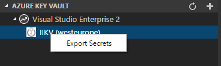

# VS Code Azure Key Vault Explorer

Azure Key Vault Explorer for VS Code.

## TODO list

* Implement Export command
* Recheck all imports
* Change KV icon to be transparent
* Later implement Export Keys, etc.
* Implement logout from azure (there is command for that)
* Check other things...
 
## Helpful pages (for me)
* https://github.com/formulahendry/vscode-azure-storage-explorer

## Features

* List Subscriptions
* List Key Vaults
* Export Key Vault Secrets to new document

## Prerequisites

* An Azure Subscription. If you don't have, click [here](https://azure.microsoft.com/en-us/free/) to get a free one.

## Usage

1. Click to sign in 
    
  

2. After sign-in, click the `+` button to select Azure Subscription
3. Wait for a moment, the Key Vault list will be shown
4. Right click on key vault and select *Export Secrets*

 

5. All secrets, including their secret text will appear after some time as new document

TODO: add screenshot

## Change Log

Project is forked from [formulahendry/vscode-azure-virtual-machine-explorer](https://github.com/formulahendry/vscode-azure-virtual-machine-explorer)

See Change Log [here](CHANGELOG.md)

## Issues

Currently, the extension is in the very initial phase. If you find any bug or have any suggestion/feature request, please submit the [issues](https://github.com/iricigor/vscode-azure-key-vault-explorer/issues) to the GitHub Repo.
